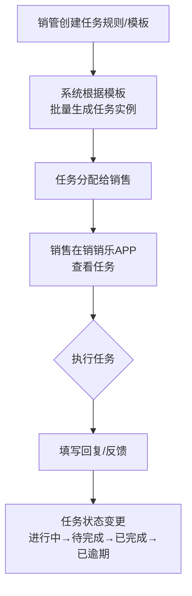
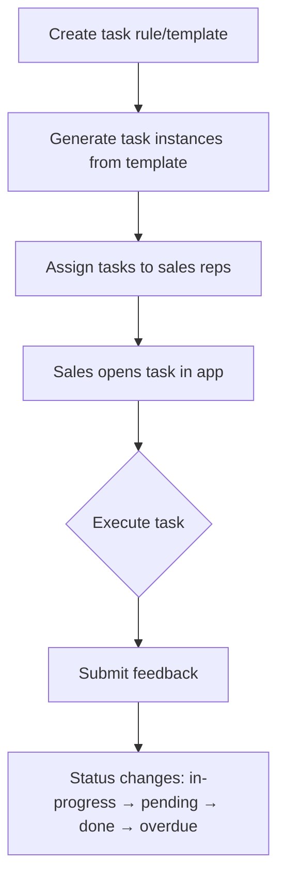

# LobeHub Markdown Editor (VS Code)


[中文](#中文说明) | [English](#english)

---

## 中文说明

### 项目简介

`LobeHub Markdown Editor` 是一个基于 `@lobehub/editor` 构建的 VS Code 自定义 Markdown 编辑器扩展。  
目标是提供比默认纯文本编辑更接近现代富文本体验的 Markdown 编写方式，同时保持与 VS Code 文件系统的实时同步。

### 主要特性

- 支持 `Open With` 打开 `.md` / `.markdown` 文件
- 支持 VS Code Custom Editor（Webview）与文本文件双向同步
- 支持 `Cmd/Ctrl + S` 保存
- 支持深色/浅色主题，并可映射 VS Code 主题颜色
- 支持浮动工具栏（加粗、斜体、列表、引用、链接、代码、公式等）
- 支持 Slash 命令（标题、列表、分割线、代码块、表格、TeX）
- 支持目录（TOC）自动生成、折叠与定位
- 支持图片上传到当前文档目录（通过扩展侧落盘）
- 支持 Mermaid 代码块图表预览（仅 `mermaid` 代码块渲染图表，其他代码块保持原有行为）

### Mermaid 支持（本次新增）

- 当代码块语言为 `mermaid`（或 `mmd`）时，编辑器会在代码块下方显示流程图预览
- Mermaid 代码块默认收起源码编辑区域，便于优先查看图表；可手动展开/收起
- 非 Mermaid 代码块（如 `ts`、`js`、`python`）保持原有代码块交互，不会被自动收起
- 点击 Mermaid 预览区域不会触发页面自动跳转

示例：

````markdown

````

### 技术栈

- VS Code Extension API（CustomTextEditorProvider）
- React + TypeScript（Webview UI）
- `@lobehub/editor` + `@lobehub/ui`
- `esbuild`（Webview 打包）
- `tsc`（Extension Host 编译）

### 项目结构

```text
.
├─ src/                    # VS Code 扩展后端（Host）
├─ media-src/              # Webview 前端源码（React）
│  └─ src/
├─ media/dist/             # Webview 构建产物（打包后生成）
├─ media/                  # 扩展静态资源（logo 等）
├─ package.json            # 扩展 manifest + 脚本
└─ README.md
```

### 配置项

在 VS Code `settings.json` 中配置：

```json
{
  "lobehub-markdown-editor.useVscodeThemeColor": true,
  "lobehub-markdown-editor.editorMaxWidth": 780
}
```

| 配置项 | 类型 | 默认值 | 说明 |
|---|---|---:|---|
| `lobehub-markdown-editor.useVscodeThemeColor` | `boolean` | `true` | 是否使用 VS Code 主题颜色映射编辑器 |
| `lobehub-markdown-editor.editorMaxWidth` | `number` | `780` | 编辑内容区最大宽度（px） |

### 本地开发

```bash
# 1) 安装扩展 Host 依赖
npm install

# 2) 安装 Webview 依赖
npm --prefix ./media-src install

# 3) 构建（Webview + Extension）
npm run build
```

然后在 VS Code 打开本项目，按 `F5` 启动 `Extension Development Host` 调试。

### 打包发布（VSIX）

```bash
npm run build
npx vsce package
```

产物示例：

```text
lobehub-markdown-editor-0.0.xx.vsix
```

安装方式：

1. 打开 VS Code 扩展面板
2. 点击右上角 `...`
3. 选择 `Install from VSIX...`
4. 选择生成的 `.vsix`

### 使用方式

1. 打开任意 `.md` 或 `.markdown` 文件
2. 在文件标签页或资源管理器右键
3. 选择 `Open with LobeHub Markdown Editor`

---

## English

### Overview

`LobeHub Markdown Editor` is a VS Code custom Markdown editor extension built on top of `@lobehub/editor`.  
It provides a modern rich editing experience while keeping full file sync with VS Code.

### Features

- Open `.md` / `.markdown` files via `Open With`
- Custom Editor (Webview) with two-way sync to text documents
- `Cmd/Ctrl + S` save support
- Light/Dark mode support with optional VS Code theme color mapping
- Floating toolbar (bold, italic, list, quote, link, code, formula, etc.)
- Slash commands (headings, lists, divider, code block, table, TeX)
- Auto-generated TOC with collapse and heading navigation
- Image upload workflow handled by extension host
- Mermaid code block preview (`mermaid` blocks are rendered as diagrams, other code blocks remain unchanged)

### Mermaid Support (New)

- Code blocks with language `mermaid` (or `mmd`) render a live diagram preview below the block
- Mermaid code blocks are collapsed by default to prioritize diagram reading, and can still be toggled manually
- Non-Mermaid code blocks (`ts`, `js`, `python`, etc.) keep their original behavior and are not auto-collapsed
- Clicking the Mermaid preview does not trigger page auto-jump

Example:

````markdown

````

### Stack

- VS Code Extension API (`CustomTextEditorProvider`)
- React + TypeScript (Webview app)
- `@lobehub/editor`, `@lobehub/ui`
- `esbuild` for Webview bundling
- `tsc` for extension host build

### Configuration

Use in VS Code `settings.json`:

```json
{
  "lobehub-markdown-editor.useVscodeThemeColor": true,
  "lobehub-markdown-editor.editorMaxWidth": 780
}
```

### Development

```bash
# Install extension-host dependencies
npm install

# Install webview dependencies
npm --prefix ./media-src install

# Build all
npm run build
```

Open this project in VS Code, then press `F5` to launch an Extension Development Host.

### Package as VSIX

```bash
npm run build
npx vsce package
```

Install:

1. Open Extensions panel in VS Code
2. Click `...`
3. Choose `Install from VSIX...`
4. Select the generated `.vsix` file

---

## License

MIT
